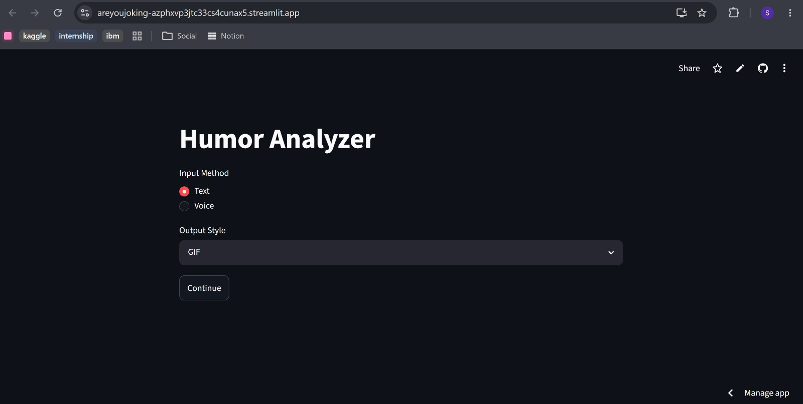
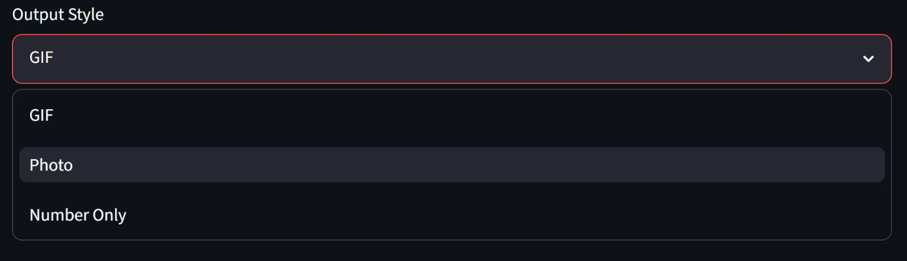
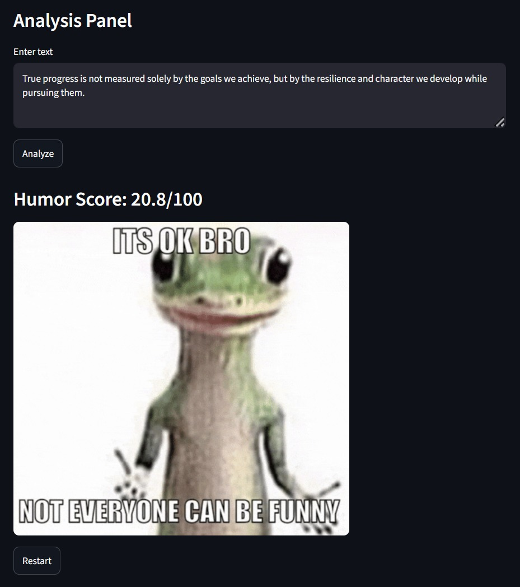

# 🤖 Was That a Joke?! (Humor Scaler)

**Was That a Joke?!** is an AI-powered application designed to analyze the "humor level" of any given text or voice input. Instead of a boring "Yes/No" classification, this project uses a fine-tuned Transformer model to judge and score jokes on a scale of 0 to 100, providing visual feedback through memes and real-time notifications via Telegram.

---

## The Purpose
The goal was to move beyond binary classification. Humor is subjective and exists on a spectrum. This project aims to **"judge"** how much a sentence resembles a joke structure by analyzing linguistic patterns, sarcasm, and punchline setups.

---

## Data & Model Architecture

### 1. The Datasets
To make the model "understand" humor, we processed a massive hybrid dataset:
* **Short Jokes Dataset:** ~20,000 clean, short English jokes.
* **Wikipedia & News Snippets:** Used as "Non-Humor" (Label 0) to teach the model what a serious sentence looks like.
* **Scrambled Data:** Randomized sentences to help the model distinguish between structure and gibberish.

### 2. Why BERT?
We used **`bert-base-multilingual-cased`** because:
* **Contextual Awareness:** Unlike older models, BERT reads sentences in both directions, catching the relationship between a setup and a punchline.
* **Multilingual Support:** It provides a foundation for understanding multiple languages, including Azerbaijani and English.
* **Fine-tuning:** We froze the base layers and trained the head specifically on humor detection.

---

## Technical Stack

### **Backend & AI**
* **Hugging Face:** The fine-tuned model is hosted on Hugging Face (`sonaamus/areyoujoking`) for cloud accessibility.
* **PyTorch:** Used for model inference and logic.
* **OpenAI Whisper:** Integrated to handle **Voice-to-Text** processing, allowing users to tell a joke instead of typing it.

### **Web Interface**
* **Streamlit:** Used to build a responsive, clean UI.
* **Session State Management:** To handle multi-step navigation (Input -> Analysis -> Results).

### **Integrations**
* **Telegram Bot API:** Every time a joke is analyzed, the result is pushed to a private Telegram channel via a bot for real-time monitoring.
* **Deep Translator:** Used to bridge the gap between Azerbaijani input and the model's high-performance English training.

---

## How It Works

1.  **Input:** User provides text or records their voice.
2.  **Processing:** Voice is transcribed via Whisper; text is smoothed and prepared.
3.  **Inference:** The BERT model calculates **Logits**.
4.  **Scaling:** We apply a **Sigmoid function with Temperature Scaling** to convert raw AI confidence into a human-readable 0-100 score.
5.  **Feedback System:**
    * **Level 1-2 (0-40):** Serious/Dry (Meme feedback).
    * **Level 3 (40-60):** "Meh" (The awkward middle ground).
    * **Level 4-5 (60-100):** Peak Comedy (Celebratory memes).

---

##  Project Structure
```text
├── app.py              # Main Streamlit application
├── requirements.txt    # Python dependencies
├── memes/              # Visual assets (GIFs/Images)
└── README.md           # Project documentation




